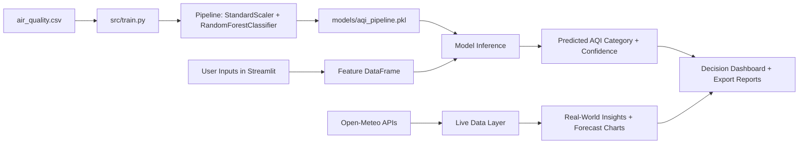

# Enterprise Air Quality Intelligence System

[](https://www.python.org/)
[](https://streamlit.io/)
[](https://scikit-learn.org/stable/)
[](https://plotly.com/python/)

An end-to-end environmental intelligence platform that converts raw atmospheric chemistry into instant, understandable health guidance.

This system combines machine learning prediction, interactive simulation, live global telemetry, comparative benchmarking, and forecasting-style analytics into one production-style application.

## The Elevator Pitch

Air pollution is often invisible, and raw pollutant measurements are difficult for non-specialists to interpret. This project translates complex pollutant signals into practical outcomes:

- Predicts AQI category from environmental inputs
- Explains how the model reached that decision
- Monitors live city-level pollution conditions
- Flags unsafe conditions using deterministic safety guardrails
- Compares cities with an automated verdict engine

## Table of Contents

- [Architecture Overview](#architecture-overview)
- [The 6 Core Modules](#the-6-core-modules)
- [Core Concepts Explained](#core-concepts-explained)
- [Engineering Highlights](#engineering-highlights)
- [Technology Stack](#technology-stack)
- [Project Structure](#project-structure)
- [Training and Inference Flow](#training-and-inference-flow)
- [Data Schema](#data-schema)
- [Known Limitations](#known-limitations)
- [Roadmap](#roadmap)
- [Contributing](#contributing)
- [How to Clone and Use This Project from GitHub](#how-to-clone-and-use-this-project-from-github)

## Architecture Overview



## The 6 Core Modules

1. Live Dashboard (Manual Simulation)
- Users simulate an environment with sliders: temperature, humidity, PM2.5, PM10, NO2, SO2, CO, industrial proximity, and population density.
- The trained model immediately predicts AQI category and renders severity through KPI cards, gauges, and toxicity visuals.

2. Model Analytics (Explainable AI)
- Confidence distribution shows the model probability split across AQI classes.
- Environmental footprint radar reveals whether the profile is particulate-heavy or gas-heavy.
- Decision weights expose feature importance from the trained Random Forest.
- What-if simulation isolates one variable and shows how risk changes over a continuous range.

3. Export Center (Compliance and Reporting)
- Captures the current simulation state, predicted label, recommendation, and confidence.
- Exports a clean CSV report for auditing, documentation, and external sharing.

4. Real-World Data (Live Satellite-Backed Tracking)
- Fetches coordinates by city name and retrieves current weather plus live pollutant telemetry.
- Renders map location, 24-hour PM2.5 trend, and hazard profile.
- Applies deterministic safety guardrails based on WHO-inspired limits for immediate warning logic.

5. Multi-City Comparison (Automated Benchmarking)
- Pulls live pollutant data for two cities simultaneously.
- Computes a normalized toxicity score from pollutant-to-safe-limit ratios.
- Declares a clearer winner and explains which pollutants caused the losing city to underperform.

6. Deep Learning Forecaster (Time-Series Simulation View)
- Demonstrates LSTM-style forecasting analytics on live API trends or uploaded datasets.
- Outputs forecast projection, uncertainty funnel, anomaly detection, and training convergence style chart.
- Complements the main Random Forest classifier with sequence-analysis style interpretation.

## Core Concepts Explained

### 1) Supervised AQI Classification
The system learns a mapping from environmental features to an AQI category label.

### 2) End-to-End Pipeline Modeling
Preprocessing and model inference are bundled into a single scikit-learn pipeline for consistency and deployment reliability.

### 3) Probabilistic Decision Support
The app exposes class probabilities so users can evaluate prediction confidence, not just a hard category output.

### 4) Human-in-the-Loop Scenario Testing
Interactive sliders and what-if tools help users test policy, weather, and pollution scenarios in real time.

### 5) Deterministic Safety Guardrails
In live monitoring paths, threshold-based safety logic is used to enforce conservative health warnings during severe spikes.

### 6) Practical ML Productization
The project includes data loading, model training, artifact persistence, inference UI, and report export in a single reproducible workflow.

## Engineering Highlights

- Resilient networking: live API calls are wrapped with graceful error handling for timeout, connection, and service-level issues.
- Interactive decision intelligence: combines simulation, live data, explainability, and reporting in one interface.
- Production-style artifact flow: trained model is serialized and loaded at runtime for consistent predictions.
- Health-first design: deterministic alert guardrails reduce blind dependence on model output under extreme conditions.

## Technology Stack

- Python
- Streamlit
- Pandas and NumPy
- scikit-learn
- Plotly
- Joblib
- Open-Meteo APIs

## Project Structure

```text
AQI-Prediction-System/
|-- app.py
|-- README.md
|-- requirements.txt
|-- data/
|   `-- air_quality.csv
|-- models/
|   `-- aqi_pipeline.pkl   (created after training)
`-- src/
    `-- train.py
```

## Training and Inference Flow

1. Prepare dataset in the data folder as air_quality.csv.
2. Run training script from src folder.
3. Pipeline is trained and saved as models/aqi_pipeline.pkl.
4. Streamlit app loads the saved pipeline and performs real-time predictions.
5. User receives category, confidence, visual analytics, and downloadable report.

## Data Schema

Required feature columns:

- Temperature
- Humidity
- PM2.5
- PM10
- NO2
- SO2
- CO
- Proximity_to_Industrial_Areas
- Population_Density

Required target column:

- Air Quality

## Known Limitations

- Prediction quality depends on dataset quality, representativeness, and class distribution.
- Real-time modules require internet access and third-party API availability.
- Unit conversion factors in live telemetry paths are approximation-based and should be validated for strict regulatory workflows.
- Deep learning section currently provides forecasting-style simulation analytics rather than a separately persisted LSTM model file.

## Roadmap

- Add experiment tracking and versioned model registry
- Add SHAP-based local explainability
- Add schema validation and data-quality checks
- Add automated test and CI workflows
- Add containerized deployment

## Contributing

Contributions are welcome.

1. Fork the repository
2. Create a feature branch
3. Commit clear, focused changes
4. Open a pull request with screenshots and rationale

## How to Clone and Use This Project from GitHub

Follow these exact steps on any machine to run the full system locally.

### 1) Clone the repository

```bash
https://github.com/urprajesh23/global-aqi-predictive-engine.git
cd global-aqi-predictive-engine
```

### 2) Create a virtual environment

Windows PowerShell:

```powershell
python -m venv venv
.\venv\Scripts\Activate.ps1
```

macOS or Linux:

```bash
python3 -m venv venv
source venv/bin/activate
```

### 3) Install required packages

```bash
pip install -r requirements.txt
```

### 4) Add dataset

Place your dataset file at the following path with this exact name:

- data/air_quality.csv

### 5) Train the model

Run training from inside the src directory so relative paths resolve correctly.

```bash
cd src
python train.py
cd ..
```

After successful training, this file must exist:

- models/aqi_pipeline.pkl

### 6) Start the Streamlit app

```bash
streamlit run app.py
```

### 7) Open in browser

Visit the local URL shown in the terminal, usually:

- http://localhost:8501

You can now use all modules: simulation dashboard, model analytics, report export, live city tracking, city comparison, and forecasting analytics.
